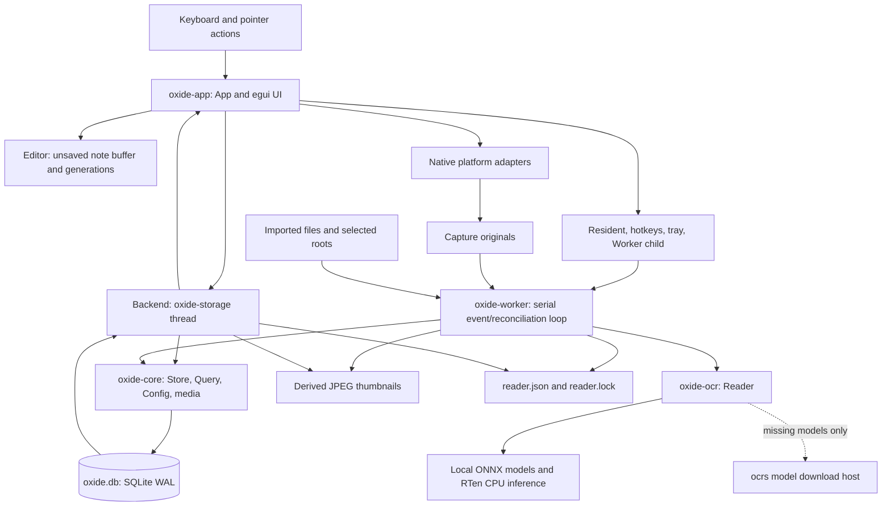
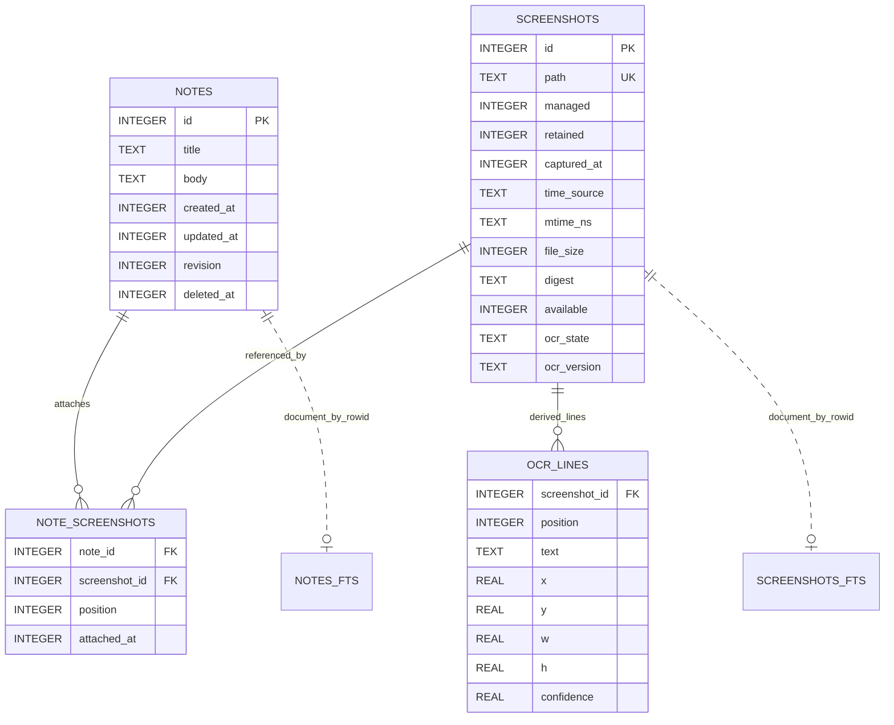

# Oxide - Architecture and Developer Handoff

**Reviewed snapshot:** `301002f8e694475642a6e9476d6aeefb85fc2d5b`, working tree on 2026-10-08. Source behavior below is **Observed** unless marked otherwise. The supplied reports are reference evidence for Gyotaku, not an Oxide dependency.

Read this first for implementation takeover. Continue with [the codebase report](OXIDE_CODEBASE_REPORT.md), [product review](OXIDE_PRODUCT_REVIEW.md), [UX/design review](OXIDE_UX_DESIGN_REVIEW.md), and [prioritized roadmap](OXIDE_FEATURE_ROADMAP.md).

## 1. System Shape

Oxide is a local desktop application with two executables and two shared libraries. It has no browser frontend, product HTTP API, remote account, cloud database, hosted OCR, or message broker.

Arrows denote calls or data ownership, not necessarily network traffic. The only application-controlled network fetch found in the inference path is model provisioning in `crates/ocr/src/lib.rs`. Clipboard, picker, viewer, and trash are local OS integrations.

## 2. Repository and Module Responsibilities

| Path | Entry points / components | Responsibility | Depends on | Improvement boundary |
|---|---|---|---|---|
| `Cargo.toml`, `Cargo.lock` | Workspace, shared versions, lint policy, profiles | Four crates; Rust 2024; resolver 3; locked dependency graph | Rust/C compiler for SQLite | Align license metadata; validate minimum Rust version explicitly |
| `crates/core/src/lib.rs` | `Note`, `NoteSummary`, `Screenshot`, `Line`, `WorkerStatus`, `now` | Shared types and line geometry validation | Serde, chrono | Replace scattered state strings with enums at boundaries |
| `crates/core/src/config.rs` | `Paths::discover`, `Config::load/validate/save`, `atomic_write` | OS path discovery, workspace descriptor, TOML, safe publication | directories, TOML, tempfile | Keep root/shortcut validation policies aligned across callers |
| `crates/core/src/media.rs` | `load_image`, `fingerprint`, `save_capture`, `thumbnail`, `export_note` | Bounded media, original publication, preview generation, portable export | image, SHA-256, filesystem | Avoid repeated full decode; preflight multi-file export |
| `crates/core/src/query.rs` | `Query::parse`, `matches_line`, `like_literal`, `day_start` | Query grammar, local calendar bounds, literal escaping | chrono | Inject timezone/clock for reproducible date edge tests |
| `crates/core/src/store.rs` | `Store`, schema, migration/backup, notes, screenshots, OCR, search | Canonical and derived persistence invariants | rusqlite/FTS5, media | Private domain submodules; retain one concrete connection and transaction policy |
| `crates/ocr/src/lib.rs` | `Reader::prepare/read` | Model hashes/downloads; reusable inference engine and Rayon pool | ocrs, RTen, ureq, core | Separate provisioning progress from ready engine; measure text corpus before engine change |
| `crates/worker/src/main.rs` | `run`, `SourceScan`, `import_image`, `write_status`, power/priority helpers | CLI and serial worker: events, roots, jobs, reconciliation, status | core, OCR, notify | Extract coordinator from CLI only when adding richer scheduling/tests |
| `crates/app/src/main.rs` | `main/run`, `icon` | Parse flags, paths/config, resident claim, hidden eframe bootstrap | core, eframe, rfd | Explicit first-run surface and startup capability feedback |
| `crates/app/src/app.rs` | `App`, `Launch`, `AfterSave`, `Confirmation`, `Capture`, `Texture` | Main state machine, replies, command orchestration, capture, recovery, render | backend/editor/lifecycle/platform | Typed feature state structs and response correlation |
| `crates/app/src/editor.rs` | `Editor::changed/begin_save/saved/failed` | Editor buffer and asynchronous save acknowledgement | core `Note` | Keep this independently testable; add delayed-switch/save cases |
| `crates/app/src/backend.rs` | `Backend::start/send`, `Request`, `Response`, `Snapshot`, `operation` | One storage/capture thread; file/config/DB work off UI | core, platform, clipboard, trash | Priority/coalescing only where measured; operation-specific errors |
| `crates/app/src/lifecycle.rs` | `Resident`, `Hotkeys`, `Worker`, Windows `Tray` | Instance locking, wake IPC, shortcut registration, child lifetime | global-hotkey, OS socket/loopback, egui context | Bounded shutdown and rotation of reader log |
| `crates/app/src/platform.rs` | `Display`, `displays`, `set_exclusion`, `hide_for_capture`, `capture`, `startup` | Common platform facade | winit/raw handle, OS modules | Honest capability descriptors; no speculative universal exclusion trait |
| `crates/app/src/platform_linux.rs` | `unmap`, `capture` | X11 unmap synchronization and pixel conversion | x11rb | Real compositor/multi-monitor evidence; Wayland is separate work |
| `crates/app/src/platform_windows.rs` | `set_exclusion`, `capture`, `CaptureResources::drop` | Affinity/read-back, DWM flush, GDI bitmap capture and RAII | windows-sys | Runtime/DPI/output tests; minimize per-frame treatment overhead |
| `crates/app/src/app/design.rs` | `Palette`, `apply_theme`, `primary/quiet/section/caption/card` | Theme tokens, widget defaults, typography, surfaces | egui | Complete semantic focus/status tokens and test contrast |
| `crates/app/src/app/shell.rs` | `header`, `workspace_rail`, `status_bar`, `navigate`, `privacy_control` | Shell, nav, search focus affordance, notices | `App` | Uncouple source folders, recent results, and actual collections |
| `crates/app/src/app/notes.rs` | `note_sidebar`, `note_editor`, `image_actions` | Virtualized note list, text editor, attachment strip, import/paste | `App` | Stable row geometry, explicit attach target, editor-first compact mode |
| `crates/app/src/app/screenshots.rs` | `library`, `shot_tile`, `detail`, `detail_actions`, `detail_image` | Virtualized library, original detail, OCR selection/output | `App` | Correlate detail data by screenshot ID and add keyboard result navigation |
| `crates/app/src/app/settings.rs` | `filters`, `changed_query`, settings tabs | Filters and setting draft UI | `App`, config | Structured filters and a first-run quick path |
| `tests/gui_smoke.py` | Native keyboard/mouse workflow | X11 typing, acknowledged persistence, own-capture pixel, hide/wake/restart | libX11/libXtst, Xvfb, FFmpeg | Current fixed coordinates predate shell redesign; verify before trusting as current regression evidence |
| `crates/worker/examples/pipeline_smoke.rs` | Generated fixture -> OCR -> SQLite -> export -> reset | Real inference/storage integration | Fonts, actual models, core/OCR | Add known phrase/box accuracy checks across a small corpus |
| `crates/core/examples/search_bench.rs` | Synthetic 10k/1k corpus and 100 queries per case | Storage/search latency path | SQLite | Queue/input-to-paint and cold startup are separate measurements |
| `.github/workflows/ci.yml` | Linux/Windows matrix | fmt/check/tests/Clippy/build/pipeline and GUI smoke | Native runners, stable Rust | Add installer and output evidence separately; workflow presence is not success |
| `packaging/windows/oxide.iss` | Per-user installer | Copy both release executables, shortcuts, uninstall Run value | Inno Setup 6 | Offline models, resident update and license payload need acceptance |
| `docs/`, `README.md`, `PRD.md`, `Project report/` | Current guidance, requirements, reference | Product and developer handoff | None at runtime | Docs/reference/PRD are ignored by current `.gitignore`; establish intentional contribution policy later |

No standalone app assets directory, bundled custom font set, website, migration directory, build scripts, Linux package, or macOS adapter exists in the reviewed Oxide source. The native icon is generated by `crates/app/src/main.rs::icon`; default egui fonts are enabled. Do not import the reference project's assets or website into the repository map.

## 3. Persistence: What Is Canonical?

### Database schema 3

The diagram omits some screenshot fields for readability: width, height, error and updated revision. `changes` is a one-row monotonic database revision table. Dotted FTS relationships are application-maintained `rowid` conventions, not foreign keys. `notes_fts` and `screenshots_fts` use the trigram tokenizer.

| Category | Artifacts | Owner / lifecycle |
|---|---|---|
| Canonical authored data | `notes`, `note_screenshots`, stable screenshot identity/source metadata, managed originals | Preserved through OCR reset, cache clearing, restart, migration |
| External originals | Imported/watched image files in existing locations | User-owned; read normally, only explicitly moved by native trash |
| Derived | `ocr_lines`, screenshot/note FTS, numeric thumbnail JPEGs | Replace/rebuild independently; note FTS rebuilds from notes |
| Settings | TOML and `paths.toml` descriptor | Durable preference/path agreement; no multi-writer transaction |
| Operational | `reader.lock`, `reader.json`, `reader.log`, resident endpoint/lock | Lock indicates running process; status may be stale; logs remain local |
| Reusable model artifacts | Two pinned models in `Paths::models` | Downloaded and hash-verified, independently provisionable |
| Ephemeral | Editor's unsaved interval, query, detail/line selection, queues, textures, Settings draft | Retained while process lives; not a persistent session/history |

`Paths::discover` uses `directories::ProjectDirs` for normal operation. An explicit `--data-dir` canonicalizes a workspace root and creates/reads `paths.toml` so the child uses the same config/cache locations. A new custom app workspace defaults capture originals to its `captures/` directory. Numeric thumbnails are `cache/thumbs/<screenshot-id>.jpg`.

### Durability and migrations

`Store::open` enables WAL, FULL synchronization, foreign keys, and a 1.5-second busy timeout. An immediate transaction initializes or migrates the schema. Version 1 adds `retained`, versions 1/2 add timestamp provenance, and versions outside 0/1/2/3 are refused. Version 0 is accepted only when no non-SQLite tables already exist. Versions 1/2 trigger a no-clobber SQLite backup before migration.

`Store::save_note` checks revision and untrashed state, updates note plus FTS plus global revision in one transaction, commits, and returns the saved row. Acknowledgment is a committed save; “currently typed” is not automatically durable. Forced termination can lose the still-unacknowledged interval. `README.md` states this distinction accurately.

### Screenshot identity and state

- Same path with changed bytes updates the existing screenshot ID.
- Paired rename events call `rename_source`, which updates paths and refuses identity conflicts.
- A new path with identical digest can reuse a single missing candidate only when its old parent still exists; ambiguous candidates are not merged.
- Managed and explicitly imported (`retained`) records remain meaningful even when watched roots change.
- OCR replacement is digest-guarded by `set_ocr`; it cannot commit against a screenshot whose digest changed.
- Availability is separate from OCR state. A missing original can retain note relationships and cached recognized context.
- Note trash is `deleted_at`; it does not trash screenshots. Screenshot native trash marks the screenshot unavailable/trashed after the OS move.

**Important limitation:** `ocr_failed` is guarded by ID/state, not by the digest associated with the failed inference attempt. A late failure can overwrite a newer image's state. This is a static interleaving concern; add a digest/version-guarded failure outcome alongside `set_ocr`.

## 4. End-to-End Command Traces

### 4.1 Note save, switch, duplicate, export, quit

`note_editor` mutates strings and calls `Editor::changed`. `App::logic` waits 500 ms then calls `save`; `begin_save` snapshots one generation. The backend calls `Store::save_note` and returns `Saved(generation, note)` or `SaveFailed`. The editor copies back only revision/timestamp, never replaces the newer text buffer with an old snapshot.

`AfterSave` defers New/Load/Duplicate/Trash/Export/Quit until the buffer is clean. Failures retain the note and clear the deferred action. Hide requests a save and hides immediately; normal Quit waits for the save. Export copies attachments from the original paths into `images/`, then writes `note-<id>.md` without overwriting an existing destination. A multi-image failure can leave partial output; there is no transaction across the destination directory.

**Observed weak boundary:** after a successful queue submission for note trash, `finish_action` clears the editor before the database response. A backend failure leaves the note in storage but removes the active editing context. Recommend acknowledging the mutation before clearing UI state.

### 4.2 Capture -> original -> note -> OCR

`Action::Region/Display` or UI menu calls `start_capture`. It refreshes monitors, requests current note save, freezes the active untrashed note ID, hides Oxide, and enqueues platform capture. The note save and capture are queued serially, but the screenshot capture is not canceled merely because a save fails; already-saved source evidence still has value.

On Windows, `DwmFlush` precedes bounded GDI display capture; `CaptureResources` releases resources in `Drop`. On X11, `hide_for_capture` unmaps the window, round-trips the server, then reads root display pixels with visual masks and byte order conversion. Other platform handles fail explicitly.

For region capture, `Captured` stores a frozen image/texture and initial coordinates; pointer drag or X/Y/Width/Height fields produce a crop. Escape discards it. This is a selection **inside Oxide's window**, not a transparent whole-screen region overlay. The full-display image is already frozen before selection.

`SaveCapture` calls `media::save_capture`: adjacent temp PNG, file sync, timestamped collision-safe `persist_noclobber`, Unix directory sync. The backend registers the image with a capture timestamp, attaches it to the frozen note, and creates the thumbnail. If the note was removed, the screenshot stays in the library and the user gets an attachment failure. If registration fails after publication, the original remains in the capture directory for worker recovery.

**Recommended detail:** record capture timestamp at capture completion rather than only after encoding/publication if capture-time precision becomes important. Freeze destination path as well as note ID if settings can change mid-capture.

### 4.3 Folder watch -> OCR -> refresh

`oxide-worker::run` claims `reader.lock`, loads config, marks outdated OCR pending, and creates a 32-event notify channel. Roots consist of the capture directory and selected external folders, canonicalized where possible. Valid config is reloaded in the loop; invalid config leaves the previous configuration working. Watch registration is retried for present roots.

`SourceScan` streams nonhidden real child directories with at most 128 directory iterators. It does not follow symlink children. Scan enumeration order is filesystem order, not a guaranteed globally newest-first backfill. The database's pending selector orders managed images, then timestamp and ID descending among discovered pending rows.

Fresh images settle for about 400 ms and enter registration before old scan work. File events dropped by the bounded callback can be recovered through periodic reconciliation; there is no immediate overflow marker for the dropped event itself. Source rows reconcile 256 at a time. Removed watched roots forget only derived OCR for non-managed/non-retained rows. Unavailable roots are treated conservatively rather than as proof that every original vanished.

OCR is prepared lazily when pending images exist. First provisioning can take two 120-second-bounded network attempts (one per model). Engine failure leaves notes and cached search available. Pending processing decodes, writes a thumbnail, recognizes text, and commits lines/FTS. Errors are stored per-image and in worker status. Status writes are atomic but fallible; a status write failure can terminate the reader.

No image job is interrupted mid-inference by pause/new work. Battery pacing throttles scan discovery/backfill turns; it is not a universal OCR CPU quota. Some loops repeatedly read config and power files. Profile actual idle/backlog cost before optimizing.

### 4.4 Search -> result -> detail -> reuse

Typing or filter changes reset the loaded limit to 50, increment `query_generation`, and request a snapshot. The app validates the query before dispatch. Backend snapshots query notes and screenshots regardless of the current result type, then read attachments, selected image lines/linked notes, worker status and store revision.

Long terms are quoted FTS literals, joined by AND. Short terms use escaped LIKE. Every term must be in the same aggregate item, potentially across title/body or OCR lines. Notes are deliberately omitted when `folder` is present. Dates use local day boundaries, notes' update times and screenshots' stored time with provenance. FTS rank, recency and ID are tie-breakers.

App rejects a snapshot with a mismatching query generation. It invalidates stale textures using screenshot digest and monotonic updated value; count alone does not govern refresh. However, it still fetches full snapshots about once per second while visible. The revision is an invalidation signal, not a cheap pre-query gate.

Tiles and the attachment strip request only visible images. Backend decodes thumbnails or bounded 2400x2400 originals and returns RGBA with current OCR lines. App turns those into egui textures, caps the cache at 64 entries, and clears it on Hide. `select_shot` discards previous full textures, sets detail ID, clears selected indices and requests detail data.

**Static correctness concern:** `select_shot` does not clear or ID-tag `self.lines`/`self.linked` immediately. `detail_actions` uses these fields before the new snapshot arrives. It can display/copy old OCR against the new screenshot. Bind detail data to screenshot ID, show loading, and disable copy/insert/attach until that ID matches. Keeping the old query's results visible while a new query loads also needs an explicit pending label.

### 4.5 Recording exclusion

The initial native window is constructed hidden. `App::new` requests the saved affinity. UI/Settings toggle copies config, hides the window while changing native treatment, performs read-back, then enqueues settings persistence. Failed treatment hides the workspace. Failed config persistence attempts rollback of affinity and shortcuts. `--normal` and the Windows tray Off command request ordinary mode.

Visible Windows logic reapplies/read-backs treatment before rendering. This is stronger than a one-time preference but incurs OS calls every logic tick. It still holds the same `Arc<Window>`; actual renderer/native-handle recreation and resume behavior need execution rather than assuming the comment proves those events.

All egui detail/settings/menus are inside the same native top-level window. Native file pickers, OS notifications/taskbar/tray surfaces, external viewers and cameras do not inherit the window property. The app must keep compatibility distinct from “the OS accepted the request.”

## 5. State and Concurrency

| State | Owner | Update / invalidation |
|---|---|---|
| Unsaved note, generation, error, in-flight save | `Editor` in `App` | Input -> generation; exact save response -> acknowledgment |
| Search text, limit, filter UI, query generation | `App` | Query change -> new generation -> snapshot |
| Notes/shots/attachments/detail text | `App` snapshots | About one-second visible refresh and explicit mutations |
| Selected shot IDs / line indices | `App` hash sets | UI selection; clear on relevant detail updates, but not every query transition |
| Textures/loading/error cache | `App` maps keyed by `(id, full)` | Digest/update validation; LRU-like touch eviction; hide clears textures |
| Actual/draft/pending config | `App`; TOML on disk; worker's local copy | Validate/apply/save/ack, then worker reload |
| Capture buffer and frozen target | `App::Capture`/capture fields | Native result -> selection -> save/cancel |
| Save/snapshot/import/capture operations | `Backend` one thread | Bounded 32-request queue; unbounded response channel |
| SQLite connections | Backend thread and worker process | Independent ownership, WAL, immediate writes, timeout |
| Filesystem fresh jobs, streamed roots, source cursor | Worker process | Event settling, page reconciliation, restart rebuild |
| OCR engine and Rayon pool | Worker `Reader` | Lazy prepare; replacement on thread setting; serialized screenshot jobs |
| Resident wake/actions | Listener thread -> bounded action sender | GUI context repaint and foreground action handling |

There is no application `Mutex<Store>` or shared database connection across threads. `Arc` is primarily for native window/context handoff; `OnceLock` attaches the context to the resident bridge. This explicit ownership is a strength.

### Important coupling

- Search navigation is represented by `library`, `all_view`, and `trash_view` booleans; compact/settings/detail/capture add further independent flags. An enum for base page plus independent overlays would prevent impossible combinations.
- Last active note is in config, so selecting a note writes the same file used for OCR settings. Internal state writes and a user Settings draft can interleave; current pending checks attempt to reconcile last-note preference.
- Recent note links in the rail use the current `self.notes` query results, not an independent recent-history query. Folder-filtered search can make “Recent” disappear.
- “Collections” are source folders, not user-created collection entities. Their active state is not represented (`nav_item` is passed false for those entries).
- Capture, import, image decode, backup, export and durable save share a serial backend. Keeping work off UI is good, but queue latency is still user-visible.

## 6. Errors, Resources, and Operational Contracts

### Implemented protections

- No production `unwrap`/`expect` was found in the reviewed Rust files; listed instances are tests. `unreachable!` covers requests already dispatched before `operation`.
- Contextual `anyhow` errors are appropriate at CLI/backend/OS boundaries.
- SQL is parameter-bound; string-formatted identifiers are application-controlled constants.
- `Line::valid` bounds geometry/confidence; dimensions and decoding have explicit limits.
- Win32 handles are owned by RAII; file lock handles live as long as their owner.
- Atomic write helpers use unique temp files, sync and publication, avoiding Gyotaku's fixed-temp-name writer conflict.
- File/source errors do not reset notes or silently delete originals.

### Engineering debt to address incrementally

1. A backend request can wait behind multiple decodes/export/OCR-independent filesystem jobs. Measure queue wait and reserve/coalesce priorities for saves and latest search.
2. Replies have request generations for saves/search, but detail payload and generic error replies are not fully correlated to target/operation.
3. `Backend::drop` performs blocking shutdown enqueue and join with no deadline. A hung native/file operation can delay quit indefinitely.
4. New image move-candidate lookup uses `WHERE digest=?` without a digest index in the schema. If profiling finds this significant, add an index in a migration rather than a new identity service.
5. Snapshot cache invalidation repeatedly searches previous vectors per new screenshot, producing quadratic metadata comparison for large loaded prefixes.
6. `reader.log` opens in append mode without rotation. Long-running errors can create growing local logs that include source paths.
7. A config thread-change reload sets `reader_threads` even when replacement preparation fails. Subsequent identical config polls do not retry that replacement; restart or another setting change is the recovery.
8. Canonical screenshot/attachment registration and OS trash are separate transactions. An OS move can succeed while the database update fails; reconciliation must make this explicit.

None of these findings requires microservices, a new ORM, or a broad crate split. Fix invariants, add targeted tests, then extract code where those tests give a stable boundary.

## 7. Commands and Delivery

### Existing app flags

`oxide-app [--data-dir PATH] [--background] [--normal] [--no-worker]`

`--smoke-ui` requires an explicit disposable data directory and closes after roughly three seconds. Unknown arguments fail. `--background` retains the app hidden. `--normal` requests exclusion Off, including through resident wake. `--no-worker` still allows notes and cached search.

### Existing worker flags

`oxide-worker [--data-dir PATH] [--once | --index FOLDER | --ocr IMAGE | --search QUERY | --setup-models]`

The parser is manual and does not enforce mutual exclusivity among all mode flags; code branch order determines combined behavior. `--index` sets once. `--search` returns up to 100 screenshot paths and does not search notes. `--ocr` prints JSON `Line` output; it opens/discovers workspace/database before inference. `OXIDE_OFFLINE=1` blocks model download attempts in the worker; it is not a whole-app network firewall.

### Build and packaging facts

- Build the workspace so `oxide-worker` sits next to `oxide-app`; `Worker::start` locates it by sibling filename.
- `Cargo.toml` sets optimized dependency dev builds and thin-LTO release with stripped debug information.
- The workflow uses current stable Rust, not a pinned 1.95 toolchain. There is no separate MSRV job.
- CI performs headless/unit checks and actual OCR. Windows smoke only establishes that a GUI process opens/exits successfully, not that exclusion works in recorded output.
- Inno Setup installs both binaries per-user; it does not bundle models or an explicit LICENSE payload in `[Files]`.
- `LICENSE` contains GPLv3 while workspace `license = "MIT"`. Resolve the owner's intended license before distribution; do not automatically choose one during code cleanup.

## 8. Recommended Architectural Direction

**Recommended sequence:**

1. Add ID-correlated detail state and acknowledged destructive mutations.
2. Represent navigation and OCR/worker/operation states explicitly; preserve the existing concrete channel/store design.
3. Add queue timing and a cheap revision/status probe; keep latest-query coalescing and save priority measurable.
4. Make capture/OS-trash reconciliation testable at file/DB failure boundaries.
5. Split private store and app submodules around those stable contracts.

Retain: SQLite WAL, one concrete store per owner, serial OCR jobs with intra-job threads, checksum-pinned artifacts, stable screenshot IDs, single native app window, and no hosted content services. Introduce a new abstraction only when a real invariant or second consumer needs it.
