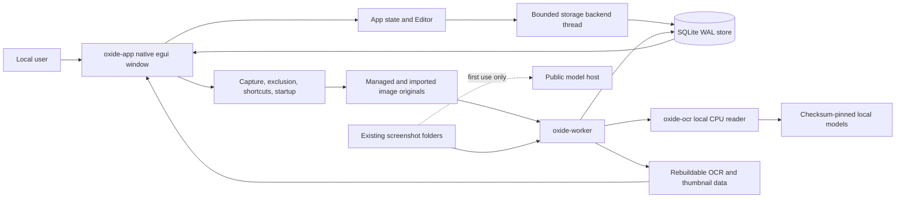

# Oxide - Codebase & Product Report

> **Scope:** repository review completed from the checked-out Oxide source, tests, build files, existing documentation, `PRD.md`, and every document in `Project report/`. This document describes the current implementation and a practical direction for future work. It does not modify or prescribe an implementation in the application.

## Executive Summary

Oxide is a local native workspace that combines three activities which are usually split across applications:

1. write a durable note;
2. capture or import visual evidence; and
3. retrieve that evidence later through text recognized inside the image.

The implementation is already a credible development product rather than a scaffold. It has a four-crate Rust workspace, SQLite-backed canonical note and screenshot relationships, a separate local OCR worker, native display capture on X11 and Windows, autosaving notes, screenshot detail with line boxes, literal multi-term search, filters, data-preserving cache rebuilds, resident lifecycle, configurable global shortcuts, and a user-controlled Windows recording-exclusion toggle.

The strongest engineering decision is the separation between authored data and derived intelligence. Notes, stable screenshot IDs, attachment relationships, and originals are treated as durable; OCR lines, FTS documents, and thumbnails can be rebuilt. That is a better fit for Oxide than the reference project's more disposable screenshot index.

The largest product risk is not the local OCR pipeline. It is the unverified contract around recording exclusion. `crates/app/src/platform_windows.rs` applies and reads back `WDA_EXCLUDEFROMCAPTURE`, but `docs/COMPATIBILITY.md` correctly says that OBS, Zoom, Teams, and Meet profiles remain unverified. Until receiver or recorded output is tested on a declared Windows baseline, “private while sharing” is an implementation intention rather than a release-level guarantee.

The largest maintainability risk is concentration of UI state and orchestration in `crates/app/src/app.rs`. The file is still understandable, but it owns lifecycle, backend responses, navigation, capture, exclusion transitions, autosave timing, texture invalidation, dialogs, and rendering. The existing split into `crates/app/src/app/design.rs`, `crates/app/src/app/shell.rs`, `crates/app/src/app/notes.rs`, `crates/app/src/app/screenshots.rs`, and `crates/app/src/app/settings.rs` is a good start. The next step should be explicit state boundaries and better failure/status modeling, not a new framework or service layer.

The product opportunity is a calm, keyboard-first “visual memory” tool for developers, presenters, researchers, and anyone who needs private working context while their screen is shared. Oxide should become memorable through a fast capture-to-context loop, dependable local search, and trustworthy state feedback. It should avoid becoming a generic notes suite, a cloud screenshot archive, or an AI assistant with no clear job.

## Evidence Convention

- **Observed:** directly confirmed in source, manifests, tests, or checked-in documentation.
- **Inferred:** a conclusion from several observed facts; useful, but not a claim made by the code itself.
- **Recommended:** a future product, UX, or engineering proposal.
- **Unknown:** not established by this checkout or by the available execution evidence.

The supplied Gyotaku reports use the same evidence discipline. They are reverse-engineered reports of a similar project, not source code for Oxide. References to Gyotaku below point to those reports, especially `Project report/04-Architecture.md`, `05-System-Flows.md`, `06-Frontend.md`, `08-Database.md`, `16-Testing.md`, and `19-Technical-Debt-and-Risks.md`.

## What Oxide Is

### Observed

`README.md` describes Oxide as “a local native workspace for notes and searchable screenshots.” The daily path is:

```text
Summon Oxide
    -> create or open a note
    -> capture a display or region, or import an image
    -> attach evidence to the active note
    -> let the local worker recognize text
    -> search notes or screenshot OCR later
    -> inspect, copy, insert, export, detach, trash, or restore
```

The app supports a compact note panel and a fuller workspace. A Windows recording-exclusion preference is exposed in the header and Settings; Linux displays it as unavailable and still supports ordinary notes, search, OCR, and X11 capture with the feature off. `PRD.md` defines recording exclusion as user-controlled, not as a claim that every possible recorder or camera can be made blind.

### Inferred product promise

Oxide is best understood as **local visual memory with private working context**. “Screenshot tool” describes capture but misses searchable OCR and note relationships. “Note-taking app” describes authored context but misses the original visual evidence and spatial text selection. The combination is the product's useful distinction.

### Current aha moment

The clearest aha moment is a screenshot that would normally be lost behind an opaque filename becoming searchable by a phrase visible inside it, with the original image and recognized line highlighted. The second aha moment is keeping that evidence beside a note while presenting or sharing the rest of the screen.

## Target Users and Jobs

The repository does not contain user research, analytics, accounts, or personas, so these are evidence-based hypotheses rather than established market facts.

| User hypothesis | Repeated job | Why Oxide fits |
|---|---|---|
| Developer or technical operator | Capture errors, commands, dashboards, and temporary states; find them by an error phrase later | OCR search, local storage, line copying, and note attachment reduce filename and context loss |
| Presenter or meeting participant | Keep private notes and references available while sharing a display | Resident summon, compact mode, hide-all, and the Windows exclusion mechanism support this job when a capture path is validated |
| Researcher or knowledge worker | Accumulate screenshots of documents, receipts, conversations, or references | Existing-image import, local OCR, date/folder filters, and portable Markdown export create a searchable visual archive |

The primary design constraint is speed. A user who is already looking at useful screen content should not need to navigate a large organizer before capturing it. Organization should follow capture and remain optional until retrieval requires it.

## Repository Structure

```text
oxide/
├── crates/
│   ├── core/                 Domain types, config, media safety, query parser, SQLite store
│   ├── ocr/                  Local OCR model provisioning and recognition
│   ├── worker/               File watcher, reconciliation, OCR scheduling, status
│   └── app/                  Native egui UI, editor, backend, lifecycle, capture, OS adapters
├── tests/
│   └── gui_smoke.py          X11 black-box workflow using real keyboard and pointer events
├── docs/
│   ├── COMPATIBILITY.md      Current capture/exclusion evidence and release matrix
│   ├── IMPLEMENTATION_STATUS.md
│   └── UI_REDESIGN_PLAN.md
├── packaging/windows/
│   └── oxide.iss             Inno Setup definition
├── .github/workflows/ci.yml  Format, check, test, Clippy, OCR, and native smoke checks
├── Project report/           37 supplied Gyotaku reference reports and diagrams
├── PRD.md                    Product and acceptance requirements
├── README.md                 Build, workflow, storage, privacy, and verification guidance
└── Cargo.toml                Rust 2024 workspace and dependency policy
```

### Major modules

| Area | Responsibility | Important files | Dependencies / concerns |
|---|---|---|---|
| Application entry | Parse app flags, discover paths, claim resident ownership, create hidden native window | `crates/app/src/main.rs` | `eframe`, `winit`, `rfd`; startup errors produce a native dialog |
| Native lifecycle | Single resident instance, bounded local wake protocol, global hotkeys, worker child, Windows tray | `crates/app/src/lifecycle.rs` | OS facilities; lifecycle and content privacy are tightly coupled |
| UI shell | Navigation, header, privacy control, sidebar, status bar | `crates/app/src/app/shell.rs` | Inline egui layout; visual tokens are centralized in part, not completely |
| Notes | Note list, editor, attachments, import/paste actions | `crates/app/src/app/notes.rs`, `crates/app/src/editor.rs` | Editor state is in memory until acknowledged by SQLite |
| Screenshots | Capture controls, library, tiles, detail, OCR highlights | `crates/app/src/app/screenshots.rs` | Texture and detail state live in `App`; display capture is platform-specific |
| Settings | Query filters, paths, theme, startup, shortcuts, OCR maintenance | `crates/app/src/app/settings.rs` | Saving startup registration and TOML is coordinated by the backend |
| App backend | Bounded request queue and one storage/capture thread | `crates/app/src/backend.rs` | Good UI isolation; long operations can still serialize behind one queue |
| Core domain | `Note`, `Screenshot`, `Line`, `WorkerStatus`, timestamps and validation | `crates/core/src/lib.rs` | Small and reusable; string states are less safe than enums |
| Configuration | Per-user paths, typed TOML, validation, atomic writes | `crates/core/src/config.rs` | Local plaintext; descriptor protects app/worker path agreement |
| Media | Bounded image decode, SHA-256, atomic capture save, thumbnails, Markdown export | `crates/core/src/media.rs` | Originals are files, not BLOBs; cross-resource operations are not atomic |
| Store | SQLite schema, migrations, note/search/screenshot/attachment/OCR mutations | `crates/core/src/store.rs` | 1,078 lines and many responsibilities; core correctness boundary |
| Query | Literal terms, `in:`, `date:`, `after:`, `before:` parsing and local-day bounds | `crates/core/src/query.rs` | Search grammar is compact and testable; incomplete date behavior should stay explicit |
| OCR | Checksummed model download, RTen CPU inference, normalized lines | `crates/ocr/src/lib.rs` | No confidence output from engine, so confidence is deliberately `None` |
| Worker | Watch roots, import/reconcile, pending OCR, status, background priority | `crates/worker/src/main.rs` | Serial image job path with bounded channels and periodic reconciliation |
| Native platform | Display enumeration/capture, exclusion, startup registration | `crates/app/src/platform.rs`, `crates/app/src/platform_linux.rs`, `crates/app/src/platform_windows.rs` | Linux X11 only; Wayland and macOS capture are not implemented |
| Verification | Unit tests, real OCR pipeline, X11 GUI smoke, synthetic search benchmark | `tests/gui_smoke.py`, examples, `.github/workflows/ci.yml` | Windows runtime exclusion and accessibility remain release gates |

## Technology Stack

| Layer | Current implementation |
|---|---|
| Language/build | Rust 2024, declared Rust 1.95+, Cargo workspace resolver 3 |
| Native UI | `eframe`/`egui` 0.36.2 over `winit` 0.30; Glow, X11, Wayland, AccessKit, default fonts enabled in the app crate |
| Storage | Bundled SQLite through `rusqlite` 0.40, WAL, foreign keys, `synchronous=FULL`, FTS5 trigram virtual tables |
| OCR | `ocrs` 0.13.1 with RTen 0.26 CPU inference and Rayon threads |
| Serialization/config | Serde, TOML, JSON |
| Media | `image` 0.25 with PNG/JPEG/WebP, SHA-256 fingerprints |
| Filesystem events | `notify` 8 in the worker |
| Native integrations | `winit`, raw window handles, X11/XCB, Windows GDI/DWM/affinity, global hotkeys, tray icon, native file dialogs, system trash, clipboard |
| Packaging | Inno Setup definition for Windows; CI workspace builds; no complete Linux/macOS package in this checkout |
| Observability | `env_logger`, local `reader.json` and `reader.log`; no native telemetry implementation |

The architecture has deliberately avoided a web backend, cloud database, message broker, service framework, or LLM provider. This is appropriate for a local-first product at the current scale.

## Architecture



### Ownership boundaries

- `oxide-app` owns the window, note editing, user commands, capture orchestration, presentation, and worker process lifecycle. It does not depend on OCR inference.
- `oxide-worker` owns filesystem observation, reconciliation, OCR preparation, and derived index updates. It has no UI dependency.
- `oxide-core` owns canonical data access and derived search/media rules. It does not know about windows or inference.
- `oxide-ocr` transforms bounded images into ordered `Line` values. It does not write the database.
- SQLite is shared through independent connections. WAL allows the app to query while the worker writes; write transactions are immediate and durable.

This is a modular local desktop architecture, not a client/server architecture. The one-process app backend thread and the separate worker are enough for the present workload. A broker or local HTTP service would add failure modes without solving an observed problem.

## Application Data Flow

### Note edit and autosave

```text
User types in egui TextEdit
    -> App mutates Editor.note and increments generation
    -> 500 ms of inactivity elapses
    -> Editor::begin_save clones the current note snapshot
    -> bounded Request::SaveNote queue
    -> oxide-storage thread calls Store::save_note
    -> transaction updates notes and notes_fts, then changes revision
    -> Response::Saved acknowledges the exact generation
    -> newer edits remain dirty and are saved separately
```

`crates/app/src/editor.rs` intentionally retains the newer buffer if a save response is for an older generation. A failed save leaves the buffer available for retry or Markdown recovery export. `Store::save_note` uses optimistic revision matching, preventing a stale snapshot from silently overwriting a newer database revision.

### Capture and attachment

```text
Capture region/display action
    -> save current note first
    -> remember active note ID in capture_note
    -> hide/unmap Oxide window for own capture
    -> platform capture returns a full-display DynamicImage
    -> optional region selection crops that image
    -> atomic PNG publication in configured capture directory
    -> Store::register_image with captured timestamp provenance
    -> attach stable screenshot ID to frozen note ID
    -> thumbnail publication and “OCR queued” notice
    -> worker registers/reconciles and runs OCR
    -> ocr_lines and screenshots_fts become searchable
```

The attachment destination is frozen when capture begins, which prevents a note switch during capture from attaching to the wrong note. The current platform implementation hides the one app window before capture. Windows also calls `DwmFlush`; Linux X11 unmaps and round-trips the window. The own-UI omission smoke check is real on Xvfb. Third-party recording output is a separate, unverified concern.

### Import and worker indexing

```text
Import, managed capture, or selected watched-folder event
    -> Store::register_image checks format, path, mtime, size, dimensions, digest
    -> screenshot row is created or stable identity is updated
    -> worker creates/rebuilds thumbnail when needed
    -> pending screenshot is selected
    -> Reader::prepare is loaded lazily when OCR is needed
    -> Reader::read produces ordered normalized Line values
    -> Store::set_ocr replaces lines and aggregate FTS document transactionally
    -> App refreshes through the store revision and shows OCR state
```

The worker has a bounded event channel, a capped fresh-path map, streaming directory scan, and a 30-second reconciliation cycle. It gives pending fresh screenshots priority over old scan work between jobs. It is serial at the screenshot-job level, while OCR uses a bounded Rayon pool.

### Search and detail

```text
Search field or filter menu
    -> App validates Query::parse
    -> Request::Snapshot carries query generation and current note/detail IDs
    -> Store queries Notes and Screenshots with all terms in one item
    -> short terms use escaped LIKE; longer terms use quoted trigram FTS
    -> folder/date predicates remain parameter-bound
    -> App receives metadata and current revision
    -> visible tiles request thumbnails lazily
    -> selecting a tile requests full image and all OCR lines
    -> normalized boxes are drawn over the rendered image
    -> user copies all/selected lines or inserts selected text into a note
```

Search does not run OCR or make network calls. Screenshot terms can span OCR lines because `screenshots_fts` stores one aggregate document per screenshot. `Query::matches_line` is intentionally looser for highlighting than database conjunction: it highlights any line containing any query term.

### Hide, restart, and resident wake

```text
Close button / Escape / global Hide
    -> flush pending save request
    -> unmap or hide the native window
    -> clear most textures, retain in-memory app state

Second launch
    -> Paths::discover
    -> Resident::claim sees resident.lock
    -> bounded local “show” or “normal” wake message
    -> current process makes its window visible

Explicit Quit
    -> wait for dirty note save
    -> close eframe process
    -> worker child is stopped by lifecycle Drop
    -> acknowledged notes and screenshots remain in SQLite/files
```

On Windows the resident endpoint is localhost with a persisted random token. On Unix it is a mode-600 Unix socket. The protocol is bounded and acknowledged, but the acknowledgment means transport acceptance, not proof that a frame is visible to a recorder.

## Major Features

The current feature inventory is below. Quality labels are this review's assessment, not automated quality scores.

## Feature-by-Feature Analysis

| Feature | Category / current state | User value | Technical quality | UX quality | Problems and limitations | Recommendation |
|---|---|---:|---:|---:|---|---|
| Durable notes | Core / implemented with autosave, trash, duplicate, export, revision guard | High | High | Medium | Save status is compact; Markdown is not rendered; note list is loaded-prefix based | Make save/recovery state more legible and keep editor focus/keyboard behavior central |
| Screenshot capture | Core / display capture plus region crop | High | Medium | Medium | X11 and Windows only; no window-target capture; capture UI is functional rather than flowing | Add capture confirmation and pending state; validate mixed-DPI and capture failure paths |
| Image import/paste | Core / PNG, JPEG, WebP and clipboard image paste | High | Medium | Medium | Import blocks on initial decode/thumbnail in storage thread; no drag/drop; no continuous clipboard in MVP | Add drop target, queue feedback, and explicit degraded thumbnail state |
| Note attachments | Core / many notes can reference stable screenshot records | High | High | Medium | Relationship navigation is present but visually quiet; no ordering controls | Make linked context bidirectional and more discoverable |
| Local OCR | Core / separate process, checksum-pinned models, offline after provisioning | High | High | Medium | First model setup is a product interruption; confidence is `None`; Latin-focused evidence only | Add clear model readiness and queue priority; publish quality/coverage fixtures |
| OCR line geometry | Core / normalized axis-aligned boxes | High | High | Medium | Line-level, not word/character-level; full-image scaling is bounded | Preserve line semantics; avoid promising precision the engine does not provide |
| Screenshot search | Core / literal multi-term substring/FTS plus short-term LIKE | High | High | Medium | Relevance is not explained; 50-item prefix and “Load more” are basic | Add result context and match snippets while preserving literal semantics |
| Notes search | Core / title/body, same query grammar | High | High | Medium | All view separates results but does not offer richer cross-context ranking | Show why a note matched and provide keyboard result navigation |
| Date/folder filters | Important / `date:`, `after:`, `before:`, `in:` and menu controls | Medium | High | Medium | Quoted folder names containing `"` are unsupported; local timestamp provenance needs explanation | Use structured filter chips and clear scope labels |
| Screenshot detail | Core / full image, metadata, line highlights, copy/insert/attach | High | High | Medium | Generic egui window; no previous/next detail navigation; no animated continuity | Turn detail into a focused reading surface with preserved query context |
| Thumbnail cache | Important / JPEG cache, independently rebuildable | Medium | High | Medium | App and worker can produce differing repair pixels; cache memory budget lacks full measurement | Establish one thumbnail contract and measure repeated browsing |
| Watched folders | Important / notify events plus periodic reconciliation | High | Medium | Low-Medium | Missing roots and event failures are status issues; no drag/drop source onboarding | Provide per-source health, pause, and rescan actions |
| Recording exclusion | Core differentiator / Windows API, Linux unavailable | Very high if needed | Medium | Medium | Every third-party output profile is unverified; OS surfaces and cameras are outside boundary | Make compatibility evidence a release gate, not a marketing assumption |
| Theme | Nice-to-have / system, light, dark with deliberate palette | Medium | Medium | Medium | Theme switching has no designed transition; focus treatment needs runtime accessibility validation | Tune tokens and add reduced-motion-aware color transition only if useful |
| Global shortcuts | Important / conflict-aware configurable summon, hide, capture | High | Medium | Medium | Text fields accept raw strings rather than a polished recorder UI; OS conflicts remain environment-specific | Add live recording affordance and per-action test feedback |
| Resident lifecycle | Important / hide, relaunch wake, tray on Windows | High | High | Medium | One resident process and one window simplify privacy but make shell state dense | Keep one window; make hidden/resident status discoverable without distraction |
| Note trash | Important / soft delete and restore | Medium | High | Medium | No permanent empty-trash policy; trash navigation is separate but visually modest | Add retention/empty semantics only when user need is proven |
| Screenshot trash | Important / recoverable OS trash after confirmation | Medium | Medium | Low-Medium | No in-app undo; partial cross-resource failure is difficult to explain | Add per-item result details and platform capability wording |
| Markdown export | Important / copies images and relative links | Medium | High | Medium | Partial image export can leave a destination; no export preview | Add a preflight summary and portable bundle verification |
| Backup/cache reset | Important / SQLite backup and derived cache clearing | Medium | High | Low-Medium | Database backup does not include originals; users can misunderstand completeness | Use “database snapshot” language and offer a backup checklist |
| OCR retry/reindex | Important / per-image and whole-library requests | Medium | High | Medium | Queue priority/status is not shown at item granularity | Expose pending/failed counts and “why pending” explanations |
| Worker pause/status | Important / child process, JSON status, paused state | Medium | Medium | Low-Medium | Status is a single text state and errors can remain stale | Model status as typed phases and show source/worker health separately |
| Accessibility foundation | Incomplete / egui AccessKit feature enabled, not executed as a release check | High | Unknown | Unknown | Custom structure, focus, contrast, text scaling, IME, and screen-reader behavior need validation | Test on chosen platform with keyboard and screen-reader tools before release |
| macOS/Linux parity | Incomplete / Linux X11 capture only, exclusion unavailable; macOS native capture absent | Medium | Low for parity | Low for unsupported users | README is clear, but cross-platform product expectation can drift | Treat platform support as explicit capability matrix |

## Current UX Review

### What a new user understands

The first visible language is reasonably clear: “Keep the context,” “Notes, screenshots and the text inside them,” “Saved locally,” and “Local only” express the product. The empty screenshot state explains capture/import/folder setup. However, first launch opens Settings because onboarding and ongoing settings share a surface. A new user must infer what to do first, which recording exclusion means, and why OCR preparation is separate from note availability.

### Where friction appears in the core workflow

1. **Open:** the resident app is useful, but the shell presents logo/menu, search, new note, privacy, settings, and lifecycle actions in one crowded header.
2. **Capture:** the user selects a display through a menu and then sees a full-display preview for region selection. This is reliable and explicit, but it is not yet a quick visual confirmation flow.
3. **Review:** a new screenshot can be attached before OCR, which is good. The UI's “OCR pending” label is accurate, but the user is not shown an expected queue position or an easy retry explanation.
4. **Edit note:** the plain multiline editor is appropriate for the stated scope and accepts Markdown syntax. It has no rendered preview, which is acceptable if clearly intentional. Capture/import actions compete with editor actions in small menus.
5. **Organize:** folders appear as collections and notes have a sidebar/trash. There are no tags, collections beyond source folders, or saved searches, so organization is currently shallow.
6. **Search:** literal semantics are a strength for error codes and punctuation. The result view does not sufficiently explain whether the hit came from title/body/OCR, and result continuation is only a “Load more” button.
7. **Reuse:** copy all/selected OCR lines, insert into a note, attach to another note, and Markdown export are valuable. External opening is explicit, which is important because it is outside the exclusion boundary.

## Current UI Review

### Current UI strengths

- Clear warm neutral palette and restrained oxide accent in `crates/app/src/app/design.rs`.
- A single native window means all app-rendered surfaces share the Windows exclusion treatment.
- Visible status separates note save, reader state, and local-only messaging, even though hierarchy can improve.
- Empty states provide an action rather than only a blank canvas.
- Tiles, attachments, detail, and capture controls are split into modules instead of all being in one render function.
- The design plan in `docs/UI_REDESIGN_PLAN.md` already identifies the right direction: a stable rail, a less crowded top bar, named tokens, and consistent surface hierarchy.

### Current UI weaknesses

- The top bar carries too many unrelated controls.
- The app uses several generic egui windows for detail, Settings, and confirmation, so modal hierarchy is not yet a product language.
- Screenshot cards resemble forms because the tile includes a default card and checkbox; image content should dominate.
- Search, note editing, and screenshot browsing share a shell but do not yet share a strong information architecture.
- State labels are accurate but low prominence. “Saved locally,” “OCR pending,” exclusion state, and database/worker failures need distinct visual semantics.
- Focus visibility, accessible names, screen-reader status, contrast under both themes, and text scaling are not established by the GUI smoke test.

## Animation and Motion Review

### Observed

`apply_theme` sets egui `animation_time` to `0.12`, and the UI uses normal egui interaction transitions. There is no dedicated capture-enter animation, thumbnail insertion animation, detail expansion transition, search result transition, or undo snackbar sequence. Capture selection has a direct rectangle stroke, and detail is a standard egui window. This is coherent with a low-distraction native tool, but it leaves the product feeling more functional than finished.

### Recommended motion principles

Motion should communicate causality and state, never compensate for unclear layout:

- **Fast: 100-140 ms.** Hover, focus ring, pressed feedback, selection tint, filter-chip changes.
- **Medium: 180-240 ms.** Detail overlay opening, sidebar width, search result replacement, toast/undo entry, capture thumbnail insertion.
- **Slow: 280-380 ms.** Only major layout continuity or first-use guidance; avoid routine use.
- **Easing:** ease-out for entering content, ease-in for removal, standard ease-in-out for reflow. No spring bounce for storage or privacy state.
- **Reduced motion:** use immediate state changes or opacity-only feedback; never delay a saved/captured result to finish an effect.
- **Performance:** prefer opacity and transform; do not animate full-size decoded images or trigger OCR from an animation callback.

A coherent motion system is specified in `docs/OXIDE_UX_DESIGN_REVIEW.md`.

## Performance Review

### Observed performance-sensitive paths

| Area | Evidence | Risk | Practical next step |
|---|---|---|---|
| Image decode | `media::load_image` enforces 128 MiB/64 megapixel and decoder allocation limits; backend decodes full images for detail | Large valid images still create multiple RGB/RGBA copies | Measure 4K and repeated detail opens; keep bounded preview and full-image lifetimes explicit |
| Capture buffers | Windows and X11 capture allocate width x height x 4 bytes before encoding | Large multi-display capture can be memory-heavy | Validate maximum display dimensions and report allocation failures clearly |
| OCR | `Reader::read` clones/downscales into RGB and uses a bounded Rayon pool | OCR is CPU-heavy, but isolated from typing | Measure fresh vs backlog latency and prioritize new captures |
| Worker queue | `fresh` is capped at 1024 and the notify channel is sync-bounded at 32; scan is streamed | Overflow causes reconciliation, not necessarily immediate visibility | Show “reconciling” state and test burst captures |
| SQLite search | Trigram FTS for terms of 3+ chars, escaped LIKE for short terms, indexed dates/path | Short-term searches can scan aggregate text; FTS ranking joins add work | Keep `search_bench` as a regression benchmark and add realistic path distributions |
| UI texture cache | `App` keeps at most 64 textures and clears on hide | Total GPU/RAM budget is not measured | Add repeated browse/open/hide measurement on the agreed baseline |
| Backend queue | Storage operations use one worker and a 32-item sync channel | Long import/thumbnail work may delay save/snapshot messages | Instrument request latency and reserve save priority if evidence shows contention |
| Directory scan | `SourceScan` keeps a stack and deduplicates roots with an O(n²) check | Very large root lists make setup work scale poorly | Replace with sorted prefix dedup only if real root counts justify it |
| Model download | `Reader::prepare` reads up to 128 MiB into memory before verification | First-run network failure affects OCR readiness, not notes | Add bounded response policy, progress, retry, and offline setup messaging |

The current `crates/core/examples/search_bench.rs` is useful because it explicitly does not claim GUI or OCR latency. `docs/IMPLEMENTATION_STATUS.md` records a synthetic corpus run and a one-fixture OCR timing, but those are development evidence, not release p95 results.

## Rust Engineering Review

### Strengths

- Ownership is mostly explicit: `Store` owns one `rusqlite::Connection`, `Backend` owns a storage thread and bounded request sender, `Worker` owns the child process, and `CaptureResources` owns Windows GDI handles with `Drop` cleanup.
- `anyhow::Context` provides useful path/action context at process boundaries.
- The Windows unsafe surface is small and documented with safety comments. `Cargo.toml` denies undocumented unsafe blocks through the workspace Clippy lint.
- `Store` uses immediate transactions for note, attachment, OCR, and screenshot mutations. Note FTS updates are in the same transaction as note content.
- `Line::valid`, image dimension limits, input length limits, and shortcut duplicate checks establish useful invariants at boundaries.
- Stable screenshot IDs are retained across path moves, OCR replacement, invalid-image repair, and thumbnail rebuilds.

### Weaknesses and opportunities

- State values such as `ocr_state`, `time_source`, and worker `state` are strings. Typed enums with explicit serialization would reduce invalid combinations and make UI exhaustiveness safer.
- `Store` is a 1,078-line persistence module. It is a legitimate boundary, but note, screenshot, OCR, migration, and search operations could be separated behind private submodules while keeping one connection and transaction policy.
- The app's `App` struct is a large mutable state machine. Extracting `PrivacyState`, `CaptureState`, `LibraryState`, and `SettingsDraft` would reduce accidental cross-feature mutation without creating a general event bus.
- The `Request`/`Response` protocol is concrete and appropriate, but responses use generic `Error(String)` for many operations. Typed operation errors would allow recovery UI to distinguish database, source, OCR, and OS failures.
- Capture-to-filesystem and database registration cannot be one transaction. The current recovery message is good; a persisted capture-intent or startup reconciliation record would make interrupted publication more explicit if failures are observed.
- The worker uses transient in-memory queues, which is reasonable for rebuildable derived OCR. It should continue to treat originals, notes, and attachment metadata as the durable source of truth.
- `Config::validate` is strong for normal settings but worker root canonicalization and UI folder deduplication should share one explicit policy.

### Avoided complexity

Do not add Tokio, a local HTTP API, a job broker, microservices, a domain event bus, or a dependency-injection container merely to make boundaries look formal. The current concrete structs and channels are easier to follow and fit the local product.

## Security and Privacy Review

### Observed

- Notes, OCR text, SQLite WAL/SHM, thumbnails, models, logs, and originals are local plaintext under the current OS user's directories. `README.md` explicitly says recording exclusion is not encryption.
- Native OCR and search do not upload pixels or recognized text. Only first-use model downloads contact a public model host, and model bytes are checksum checked before publication in `crates/ocr/src/lib.rs`.
- SQL values are bound and FTS/LIKE syntax is escaped in `crates/core/src/store.rs` and `crates/core/src/query.rs`.
- Image decoding is bounded in core media paths. Capture originals are written through temporary files and no-clobber publication.
- On Unix, resident socket permissions are set to `0600`; on Windows the localhost resident endpoint uses a random token.
- Native logs and status are local. No telemetry or account backend appears in the Oxide workspace.
- External viewer opening and native dialogs are explicit OS-boundary actions. Content-bearing note/OCR data is not intentionally put in window titles or system notifications.

### Limits

- Local storage is not encrypted at rest. A privacy-first product claim would need to say “local-only by default,” not imply protection from another process or an OS account compromise.
- The model download is external network activity during setup. Offline mode is available once models are provisioned.
- The app can access user-selected folders and the native clipboard paste action. This is expected functionality, but permission scope should remain visible.
- Windows API application/read-back is not receiver-output validation. Camera capture or recorder paths that ignore the affinity mechanism remain outside the contract.
- No cross-platform secure deletion is provided; trash and cache removal follow OS/filesystem semantics.

### Positioning

**Supported claim:** “Local-first: notes, originals, OCR, and search stay on your device during ordinary use.”

**Not established:** encrypted, zero-leak, invisible to every recorder, or private from the host OS. Compatibility and encryption must not be conflated.

## Accessibility Review

### Observed

The app enables egui's `accesskit` feature and provides keyboard shortcuts, normal text editing, IME-compatible egui text widgets, mouse alternatives, and an Escape hierarchy. `README.md` and `PRD.md` identify keyboard operation, focus, contrast, scaling, IME, and reduced motion as requirements. The existing X11 smoke test sends real keyboard events but does not validate semantic accessibility.

### Gaps

- A runtime screen-reader pass is not present in the repository evidence.
- Focus styling is inherited from egui tokens and has not been calibrated across themes.
- Status text is visible but may not be announced as a live status change.
- Color and text labels distinguish OCR state and errors, but screenshot highlights rely heavily on accent color.
- Compact mode and 420 px minimum width need text scaling checks.
- A reduced-motion preference is not visibly represented in the native app's settings or test matrix.

### Recommended acceptance

1. Navigate first launch, note creation, capture cancellation, search, detail, attach, Settings, save failure, and recovery using only keyboard.
2. Verify every icon/action has a spoken or accessible name, including `+`, menu entries, thumbnail selection, and status indicators.
3. Verify screen-reader announcements for saving, saved, save failure, OCR pending/ready/failed, exclusion transitions, and database recovery.
4. Check contrast in both themes, at large text scaling, with focus visible and without relying on color alone.
5. Respect platform reduced-motion preference by shortening or removing future transitions.

## Gyotaku Reference Analysis

The supplied `Project report/` describes Gyotaku as a local screenshot-text search utility with a native app, a separate `watch` reader, SQLite/FTS5, local CPU OCR, thumbnails, spatial highlights, clipboard options, trash, resident summon, and an independent marketing site. It does not implement Oxide's screen capture, note-taking, or recording exclusion. This distinction is important: Gyotaku is a useful architecture and UX reference, not an existing implementation of Oxide's core differentiators.

### What Oxide should retain

- Separate UI and OCR reader processes so inference does not block search or editing.
- One aggregate FTS document per screenshot so terms can span OCR lines.
- Raw recognized text plus normalized geometry, rather than correcting text into an untraceable “answer.”
- Local SQLite WAL and user-owned originals outside the derived cache.
- Native resident lifecycle and explicit platform adapters.
- Literal short-term search alongside trigram search for identifiers and fragments.
- A conservative approach to approximate matching: exact first, bounded candidates, original OCR preserved.

### What Oxide should deliberately improve

- Notes and `note_screenshots` are canonical authored relationships; Gyotaku's disposable index model is insufficient for them.
- Stable IDs survive rename and OCR replacement; the reference allows re-indexing to change screenshot identity.
- Revision-based database invalidation avoids Gyotaku's count-only refresh weakness.
- Unknown schema versions are refused with a recovery path; they are not silently rebuilt.
- Recording exclusion must be evidence-based per recorder/backend rather than inferred from one OS API call.
- Capture feedback, note context, and search result type need to be first-class UI states.

## Oxide vs Gyotaku

| Area | Gyotaku reference reports | Oxide | What Oxide can learn |
|---|---|---|---|
| Architecture | Native app plus separate long-lived OCR reader, shared SQLite/config | Native app plus separate `oxide-worker`, shared SQLite/config, app storage thread | Preserve the process boundary and keep OCR out of the UI process |
| UI | Keyboard-first native search window, virtualized result grid, detail overlay | egui workspace with rail, notes editor, screenshot library, detail/settings windows | Keep retrieval fast, but give notes and capture a clearer hierarchy |
| UX | Search existing screenshots by remembered words, with spatial line highlights | Capture/import, attach to notes, then search OCR and notes | Extend the reference's retrieval aha into capture-to-context continuity |
| Capture | Does not capture the screen; optional clipboard image ingestion is not screen capture | Windows/X11 display capture and region cropping; paste/import | Do not mistake clipboard ingestion for capture; keep source boundaries explicit |
| Search | Trigram FTS, short LIKE, filters, bounded near matches | Trigram FTS, short LIKE, literal filters, no semantic/near search yet | Add approximate search only after exact semantics and labels are trustworthy |
| Storage | Original files plus rebuildable OCR index/cache | Original files plus canonical notes/attachments and rebuildable OCR/thumbnail data | Keep derived rebuildability, but protect authored relationships |
| Performance | Serial reader with foreground event priority and virtualized images | Serial worker with fresh-path priority, bounded queue, 64 texture cache | Measure UI latency and memory using real capture-heavy workloads |
| Organization | Folders, bursts, marks, trash/undo | Notes, source folders, attachments, note/screenshot trash | Make visual grouping serve retrieval without hiding screenshot identity |
| Extensibility | Concrete Rust crates and explicit platform adapters; separate website | Same concrete Rust approach with app/backend/worker boundaries | Avoid remote service abstractions until an actual second consumer exists |
| Privacy boundary | Local OCR/search, ordinary user files, website separate | Local OCR/search plus optional Windows recording exclusion | Document plaintext local storage and validate third-party capture paths |

## Product Opportunities

The highest-value opportunity is to make the existing relationship between screenshot, note, OCR line, and retrieval feel continuous. Specific opportunities are detailed in [OXIDE_PRODUCT_REVIEW.md](OXIDE_PRODUCT_REVIEW.md):

- screenshot intelligence: queue clarity, provenance, duplicate/burst review, and searchable line context;
- notes: quick notes, attachment backlinks, pinned notes, and lightweight templates;
- search: type-aware results, snippets, visual history, and carefully labeled exact/near/semantic modes;
- developer workflows: error capture, terminal evidence, selected-line insertion, and portable Markdown bundles.

## Creative Feature Ideas

Creative ideas should extend the existing local visual-memory workflow rather than create a general productivity suite. Candidate signature features are fast capture-to-note, validated private sharing, local visual history, a screenshot-to-note evidence graph, and developer-oriented context capture. Semantic search, smart titles, and local summaries are experiments for later phases; continuous background capture, cloud collaboration, and an always-on assistant are poor fits without a new product decision.

## UX Improvements

Prioritize the first-launch path, capture-to-note confirmation, explicit independent states, result explanations, two-way attachment navigation, source health, and keyboard/accessibility validation. The complete journey review and interaction recommendations are in [OXIDE_UX_DESIGN_REVIEW.md](OXIDE_UX_DESIGN_REVIEW.md).

## UI Improvements

Use the existing `Palette` and design helpers as a semantic system. Reduce header competition, make screenshot tiles image-first, separate primary/secondary/destructive actions, make detail/settings/confirmation surfaces consistent, and show filter chips, provenance, focus, and state labels without relying on color alone.

## Animation System

Use a small reusable system: 100-140 ms for hover/focus/selection, 180-240 ms for detail/search/rail/toast transitions, and 280-380 ms only for major continuity. Prefer opacity/transform, interrupt motion on input, never delay persistence or privacy changes, and use immediate or shortened behavior for reduced motion. See the detailed motion choreography in [OXIDE_UX_DESIGN_REVIEW.md](OXIDE_UX_DESIGN_REVIEW.md).

## Micro-interactions

The most useful micro-interactions are a thumbnail entering the active note after capture, title-adjacent save acknowledgement, “Copied N lines,” OCR pending-to-ready resolution, hover actions without tile reflow, linked-note navigation, exact match highlights, source rescan feedback, and an honest reversible-trash Undo surface. Each one should explain a state or reduce uncertainty; none should be decorative motion.

## Things Not to Build

Avoid a cloud screenshot backend, generic productivity-suite modules, always-on invisible capture, an LLM chat panel as the default workflow, semantic search before exact search is excellent, silent destructive organization, a local HTTP API, broad glass/gradient effects, and universal platform privacy claims without output evidence. The product review explains the user-value and maintenance reasons for each boundary.

## Technical Debt

### Critical

#### 1. Recording-exclusion release evidence is incomplete

- **Problem:** Windows affinity is applied and read back, but no declared OBS/Zoom/Teams/Meet receiver or saved-recording profile is verified.
- **Evidence:** `crates/app/src/platform_windows.rs`, `docs/COMPATIBILITY.md`, `docs/IMPLEMENTATION_STATUS.md`.
- **Why it matters:** This is a primary differentiator and a privacy expectation. A false “private while sharing” assumption is more damaging than a missing feature.
- **Recommended fix:** Create a disposable Windows matrix with exact OS, client, capture backend, renderer, monitor/DPI, and saved output evidence. Mark only tested combinations supported.
- **Priority:** Critical release gate.

#### 2. Accessibility behavior is not runtime-proven

- **Problem:** AccessKit is enabled, but the repository does not establish screen-reader names, live status announcements, focus order, scaling, or reduced-motion behavior.
- **Evidence:** `crates/app/Cargo.toml`, `tests/gui_smoke.py`, `PRD.md` accessibility requirements.
- **Why it matters:** The app's keyboard-first promise is incomplete if semantic focus and status are unreliable.
- **Recommended fix:** Add platform execution checks and a small manual acceptance script for the key workflows.
- **Priority:** Critical before broad release.

### High

#### 3. UI orchestration is concentrated in `App`

- **Problem:** `crates/app/src/app.rs` contains lifecycle transitions, asynchronous response handling, persistence coordination, texture management, capture, confirmation, and rendering state.
- **Evidence:** `App` has more than 1,000 lines and owns over 50 fields.
- **Why it matters:** A change to capture or privacy can unintentionally affect note saves, refreshes, or detail state.
- **Recommended fix:** Introduce small typed state structs and private command helpers while keeping the current request/response boundary.
- **Priority:** High.

#### 4. Generic error responses make recovery less precise

- **Problem:** Many backend failures become `Response::Error(String)` and a notice, while empty data and storage failure have separate but uneven paths.
- **Evidence:** `crates/app/src/backend.rs`, `crates/app/src/app.rs` response handling.
- **Why it matters:** Users cannot always tell whether there are no results, OCR has failed, the database is unavailable, or an import is still pending.
- **Recommended fix:** Use an operation/error enum internally and map it to explicit UI states.
- **Priority:** High.

#### 5. Cross-resource screenshot lifecycle is recoverable but not transactional

- **Problem:** Original publication, SQLite registration, attachment, and thumbnail creation are separate operations.
- **Evidence:** `save_capture` in `crates/app/src/backend.rs`; recovery text documents the gap.
- **Why it matters:** Crashes or disk failures can leave an unattached original or missing derived cache, which needs clear reconciliation.
- **Recommended fix:** Persist capture intent or scan managed captures on startup; keep originals and attachment metadata safe; never claim atomicity across file and SQLite resources.
- **Priority:** High.

### Medium

#### 6. OCR confidence is intentionally absent

- **Problem:** `Line.confidence` is always `None` because ocrs does not expose a trustworthy score.
- **Evidence:** `crates/ocr/src/lib.rs`, `crates/core/src/lib.rs`, `docs/IMPLEMENTATION_STATUS.md`.
- **Why it matters:** Product requirements mention confidence, but fabricated values would mislead users and ranking.
- **Recommended fix:** Keep `None` until an engine with a documented confidence contract is adopted, or revise the data contract and UI to omit confidence.
- **Priority:** Medium product decision.

#### 7. Refresh and loaded-prefix behavior need continued measurement

- **Problem:** The app uses store revision invalidation and a limit-based snapshot, but loaded metadata grows with requested prefix and does not yet provide a cursor/token model.
- **Evidence:** `App::refresh`, `Request::Snapshot`, `Store::screenshots/notes`, `docs/IMPLEMENTATION_STATUS.md`.
- **Why it matters:** Large libraries can make repeated query and refresh work less predictable.
- **Recommended fix:** Add stable continuation cursors only when real corpus measurements show the prefix model is insufficient.
- **Priority:** Medium.

#### 8. Platform capability is uneven

- **Problem:** Linux exclusion is unavailable and capture requires X11; Wayland/macOS capture are not implemented.
- **Evidence:** `crates/app/src/platform.rs`, `docs/COMPATIBILITY.md`, README platform notes.
- **Why it matters:** A cross-platform binary can be mistaken for a cross-platform equivalent product.
- **Recommended fix:** Keep the capability matrix prominent and choose one launch platform for release evidence.
- **Priority:** Medium.

### Low

#### 9. Stringly-typed states

- **Problem:** OCR and worker states are strings.
- **Evidence:** `Screenshot.ocr_state`, `WorkerStatus.state`, SQL literal states.
- **Why it matters:** Invalid state combinations become possible and UI matching is scattered.
- **Recommended fix:** Add internal enums with stable storage strings at the database boundary.
- **Priority:** Low-medium cleanup.

#### 10. Root deduplication is O(n²)

- **Problem:** `SourceScan::new` checks each configured root against all other roots.
- **Evidence:** `crates/worker/src/main.rs`, including the `ponytail` comment.
- **Why it matters:** It is unnecessary work if users configure many roots, though normal lists are small.
- **Recommended fix:** Sort canonical paths and perform a prefix pass if measurements justify it.
- **Priority:** Low.

## Final Assessment

Oxide has a coherent core: local authored notes plus durable screenshot identity and rebuildable local OCR. Its current implementation is stronger than a prototype in persistence, recovery, and platform lifecycle. The next phase should not be a broad feature expansion. It should turn the existing reliable pipeline into a more legible and validated product:

1. prove recording exclusion on the supported Windows matrix;
2. make failure/status states explicit;
3. improve capture-to-note feedback and result context;
4. validate accessibility and resource behavior; and
5. keep the architecture concrete and incremental.

The guiding sequence should remain:

```text
Working product
    -> validated product
    -> polished product
    -> carefully differentiated product
```

## Feature Prioritization

The detailed feature inventory appears above and the scored roadmap is in [OXIDE_FEATURE_ROADMAP.md](OXIDE_FEATURE_ROADMAP.md). The short ordering is:

### P0 - Fix Now

1. Validate recording exclusion against actual Windows receiver/recorded output.
2. Fix screenshot-detail response correlation and stale action state.
3. Run accessibility, focus, scaling, IME, contrast, and reduced-motion acceptance.
4. Exercise capture/storage/OCR failure paths and startup reconciliation.
5. Validate installer, offline model bootstrap, update, migration, and data-preserving uninstall.

### P1 - High Value

1. Make capture-to-note attachment and OCR progress visibly continuous.
2. Replace generic operational messages with explicit typed states.
3. Add search snippets, result types, and time/source provenance.
4. Measure and improve backend queue latency and image memory.
5. Add watched-source health, rescan controls, and practical import/drop affordances.

### P2 - Product Expansion

Stable search cursors, window/repeated-region capture, user-created tags or collections, conservative burst grouping, bounded OCR near matches, portable workspace bundles, and an OCR quality corpus belong after the core workflow is validated.

### P3 - Experimental

Semantic local search, user-confirmed smart titles, local summaries, and multi-device/cloud collaboration require separate product decisions. Continuous background screen capture should be avoided unless the privacy model changes substantially.

## Recommended Roadmap

| Phase | Objective | Technical work | UI work | Testing | Expected result |
|---|---|---|---|---|---|
| 0. Release evidence | Decide the supported launch contract | Windows exclusion matrix, packaging, offline/bootstrap, license decision | Capability and compatibility language | P0 PRD scenarios and disposable installer runs | Honest release scope |
| 1. Stability | Remove stale and ambiguous states | Detail IDs, mutation acknowledgement, digest-guarded failures, reconciliation | Loading/error/state hierarchy | Response ordering, failures, restart, migrations | No wrong-item actions or false success |
| 2. Core UX polish | Make the aha moment quick | Queue/memory instrumentation and focused optimizations | Capture handoff, save state, search context, linked navigation | Keyboard/accessibility/scaling/reduced-motion checks | A calm, understandable daily workflow |
| 3. Retrieval depth | Improve finding before adding AI | Source health, OCR corpus, optional exact-first near search, continuation if measured | Snippets, provenance, filter chips, visual history | Large corpus, OCR quality, rename/cache/filter fixtures | Faster and more reliable retrieval |
| 4. Power users | Support recurring workflows | Capture presets/targets, tags/templates/bundles only as validated | Lightweight saved scopes and evidence navigation | DPI/window identity, export/restore, schema tests | More power without product sprawl |
| 5. Differentiation | Test one memorable extension | Opt-in local derived intelligence with bounded resources | Explainable exact/semantic modes | Usefulness, false positives, privacy, offline/resource tests | A validated differentiator |

## Top 10 Recommendations

1. **Recommendation:** Validate recording exclusion on real Windows recorder and meeting-client profiles.
   - **Why it matters:** The feature is a central product promise, while current source/API evidence does not prove receiver or saved-output behavior.
   - **Expected user impact:** Users can trust the private-workspace mode on explicitly supported configurations.
   - **Implementation difficulty:** Very high operational/test effort; medium application change effort.

2. **Recommendation:** Correlate screenshot detail data and actions by screenshot ID.
   - **Why it matters:** A new detail selection can temporarily retain old lines/linked notes in `App` state.
   - **Expected user impact:** Copy, insert, attach, and retry always apply to the visible screenshot.
   - **Implementation difficulty:** Low to medium.

3. **Recommendation:** Make save, capture, OCR, worker, and exclusion states explicit and independent.
   - **Why it matters:** A local-first product depends on users knowing what is durable, searchable, private, or waiting.
   - **Expected user impact:** Less uncertainty and fewer repeated actions when processing is delayed or fails.
   - **Implementation difficulty:** Medium.

4. **Recommendation:** Build a failure-injection and reconciliation suite for screenshot lifecycle operations.
   - **Why it matters:** File publication, database registration, attachment, thumbnailing, and native trash are separate resources.
   - **Expected user impact:** Fewer lost-context incidents and better recovery after crashes, disk errors, or worker interruption.
   - **Implementation difficulty:** Medium to high.

5. **Recommendation:** Complete runtime accessibility and reduced-motion validation on the launch platform.
   - **Why it matters:** AccessKit and keyboard controls are present, but semantic names, focus, status announcements, scaling, and motion are not established by current smoke evidence.
   - **Expected user impact:** A reliable keyboard-first experience for more users and better usability in compact mode.
   - **Implementation difficulty:** Medium.

6. **Recommendation:** Polish the capture-to-note handoff.
   - **Why it matters:** Capture and attachment are technically strong but visually end in a generic notice.
   - **Expected user impact:** Immediate confidence that the original is safe, attached to the intended note, and awaiting OCR.
   - **Implementation difficulty:** Low to medium.

7. **Recommendation:** Improve search result explanation before adding semantic AI.
   - **Why it matters:** Exact literal search is already useful, but result type, match snippet, and timestamp/source provenance are under-explained.
   - **Expected user impact:** Faster scanning and fewer unnecessary detail opens.
   - **Implementation difficulty:** Medium.

8. **Recommendation:** Measure backend queue latency, OCR freshness, search latency, startup, and repeated image memory.
   - **Why it matters:** Existing benchmarks cover storage/search and one OCR fixture, not the full interactive path.
   - **Expected user impact:** More responsive typing and evidence-based performance improvements.
   - **Implementation difficulty:** Medium.

9. **Recommendation:** Make watched-folder health and reconciliation user-visible.
   - **Why it matters:** The worker can pause, lose a source, or recover through periodic scans without a rich source-level explanation.
   - **Expected user impact:** Users can fix incomplete libraries without reading logs or restarting blindly.
   - **Implementation difficulty:** Medium.

10. **Recommendation:** Resolve distribution and repository contract drift before release.
   - **Why it matters:** Workspace metadata declares MIT while `LICENSE` is GPLv3, and installer/model/runtime evidence is incomplete.
   - **Expected user impact:** Clear legal expectations and fewer installation/offline surprises.
   - **Implementation difficulty:** Low for the license decision, medium to high for release validation.

## Five Things to Build First

If only five improvements can be funded, build the following in order:

1. Real Windows recording-exclusion evidence and honest capability labeling.
2. Detail-state correlation plus capture/storage/OCR reconciliation.
3. Explicit save/capture/OCR/privacy status hierarchy.
4. Capture-to-note and search-to-detail UX polish.
5. Accessibility, performance, installer, and failure acceptance on the chosen launch baseline.

## What Could Make Oxide Memorable

Oxide becomes **distinctive** when its parts reinforce one another rather than when it accumulates more features:

```text
Functional:
    It captures screenshots, writes notes, and searches OCR.

Distinctive:
    One gesture captures the visual moment, attaches it to context,
    and later retrieves the original by the words the user remembers.

Enjoyable:
    The handoff is immediate, the state is trustworthy, the UI stays quiet,
    and the user can keep working without leaving the desktop.
```

The highest-leverage signature is **capture -> context -> visual retrieval**. If validated Windows exclusion becomes dependable, “private working context while sharing” can make that workflow memorable for presenters and developers. If exclusion remains platform-limited, Oxide can still be loved as a fast local visual history tool. The product should earn memorability through speed, provenance, and calm feedback before attempting semantic AI or cloud collaboration.
